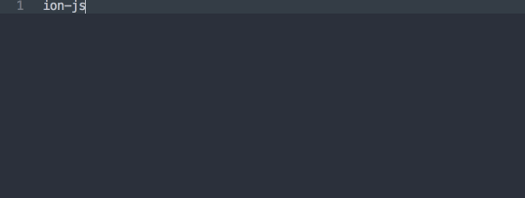
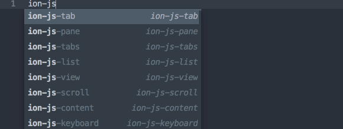

### Sublime Text plugin for Ionic snippets

Repeat typing the same Ionic code is quite tired-some. Well, if you use Sublime Text, there is a plugin I think that quite fit for [Ionic code snippets](https://github.com/PixelDropInc/ionic-snippets-sublime-plugin).

Visit plugin page for [detailed installation guide](https://github.com/PixelDropInc/ionic-snippets-sublime-plugin#installation).

There are more plugins for Sublime Text, but I think this is the best one at current time.
