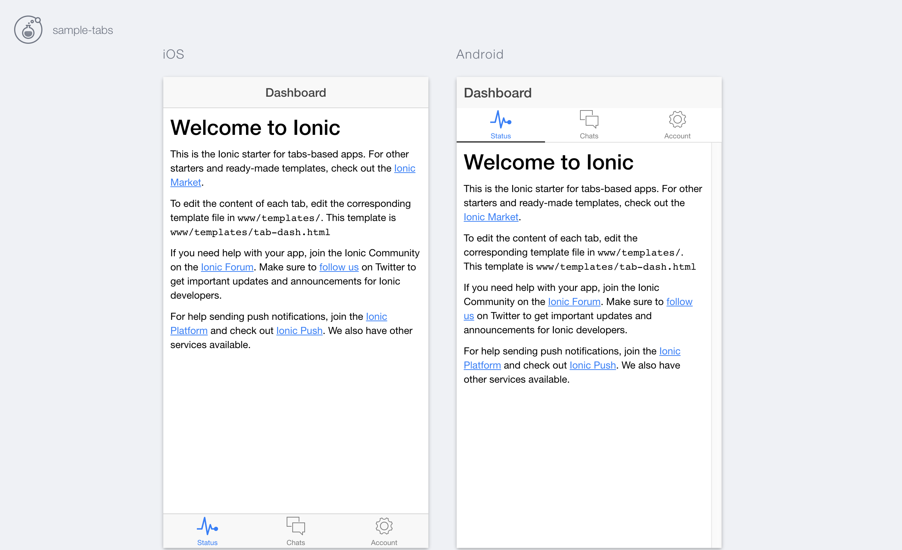

### Server apps with multiple screen sizes

While developing apps, you might want to see how apps display across different screen sizes, so using many tabs and changing to many screen sizes is much of work and is difficult to see how it display.

Fortunately, Ionic CLI provides an option to help developers deal with this situation,

```
$ ionic serve --lab
or
$ ionic server -l
```

and you will have this,


