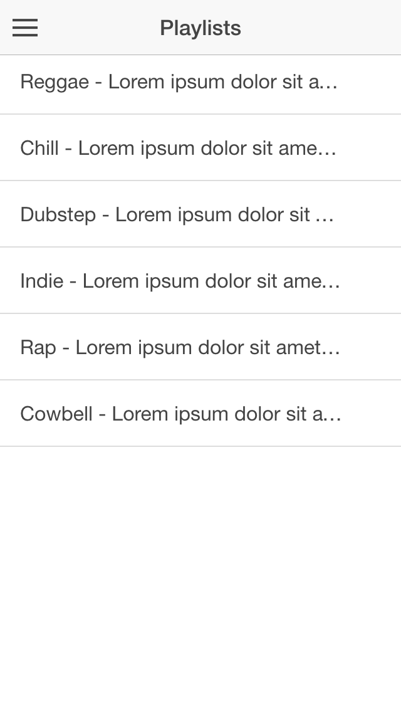

### Show the ellipsis text on item list

When display long text on list, by default, Ionic will make them hidden by ellipsis.



If you want to show them, make it simple by just adding class `item-text-wrap` to the `ion-item`,

```
<ion-item class="item-text-wrap"  ...
```

and all the hidden text will be shown.